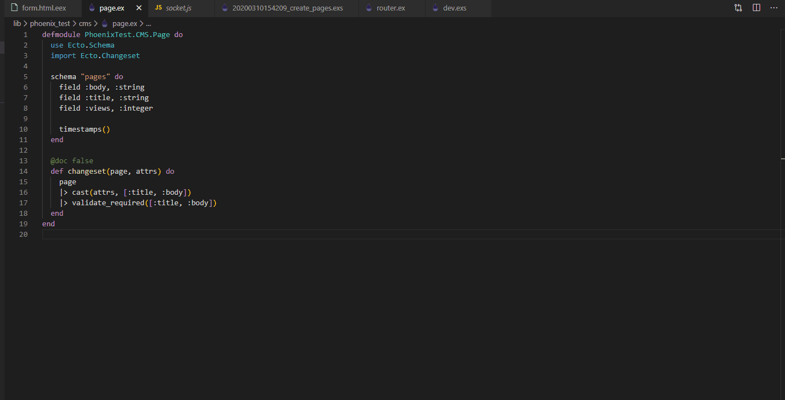
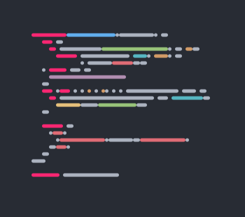
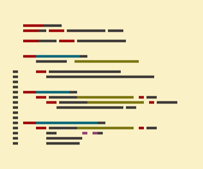

  <h2 align="center">Polafaux — Polaroid for your faux-code 📊</h2>

<!--  -->

## Why?

Because it is unnecessary therefore essential !

Turn real code (From VS Code)
into faux code (SVG image)

The code has to look right.

## Tips

- You can play with the options before saving the svg
- Default options can be configure with `polafaux.themeName`, `polafaux.fontSize`, `polafaux.leading`, `polafaux.lineCap`, `polafaux.margin`, `polafaux.lineNumbers` and `polafaux.lineNumberOffset`

## Demo

Using default options with the theme [atom-one-dark](https://github.com/atom/one-dark-ui)

Using squared lines, including line numbers with the theme [gruvbox-light](https://github.com/morhetz/gruvbox#light-mode)

## Credit

This is a direct reimplemantation of [faux-code-generator](https://github.com/knutsynstad/faux-code-generator) by [@knutsynstad](https://github.com/knutsynstad)

The main difference resides on the utilization of [highlight.js](https://highlightjs.org/) instead of relying on github gists.

## License

MIT
